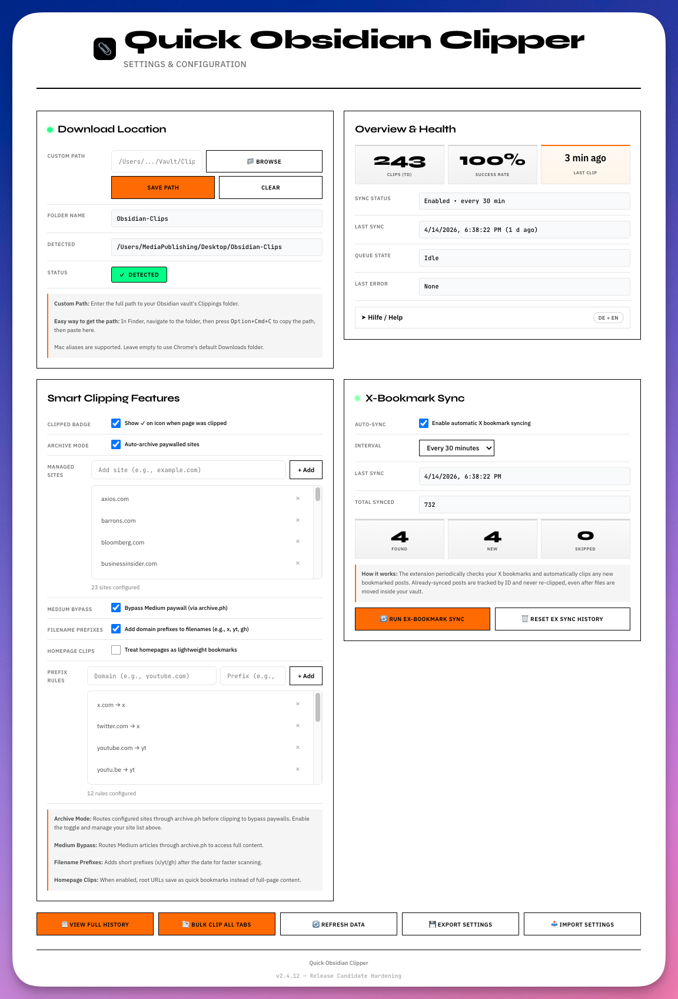

# Quick Obsidian Clipper

**One-click web clipper with smart features** - Saves pages as clean markdown to your Downloads folder, ready for Obsidian.

Landing page: <https://quick-obsidian-clipper.pages.dev>

[](https://quick-obsidian-clipper.pages.dev)

[](https://developer.chrome.com/docs/extensions/)
[](https://developer.chrome.com/docs/extensions/mv3/intro/)




## Why Quick Obsidian Clipper?

Unlike other web clippers that require complex OAuth setups or paid subscriptions, Quick Obsidian Clipper takes a **simple, privacy-first approach**:

- **No API keys required** - Works immediately after install
- **No account needed** - Your data stays local
- **Offline-capable** - Downloads to your filesystem, not to a cloud service
- **Clean markdown output** - YAML frontmatter, proper formatting, ready for Obsidian
- **Smart duplicate detection** - Alerts you if you've already clipped a page
- **Download subfolder** - Choose a safe subfolder below the browser's Downloads directory

## Features

### Core Clipping
- **One-click clipping** - Click the icon or use `Cmd+Shift+S` (Mac) / `Ctrl+Shift+S` (Win)
- **Selection clipping** - Clip just the selected text with `Cmd+Shift+C`
- **Bulk clip all tabs** - Clip every tab in your window with `Cmd+Shift+A`
- **Right-click context menu** - Clip images, links, or selections

### Smart Features
- **Clipped Badge Indicator** - Green checkmark shows when you've already clipped a page
- **Duplicate Detection** - Warns before re-clipping recently saved pages
- **URL Normalization** - Strips tracking parameters (UTM, fbclid, etc.) for accurate duplicate detection
- **Download Subfolder** - Configure a relative folder below the browser's Downloads directory

### Site-Specific Handlers
- **YouTube** - Extracts video metadata, description, and transcript when available
- **Twitter/X** - Captures tweets with author info, engagement metrics, and replies
- **Perplexity** - Clips AI search results with sources
- **Medium** - Optional paywall bypass via Freedium integration
- **Archive.ph** - Route paywalled sites through archive.ph for full content

### Output Quality
- **YAML Frontmatter** - Title, URL, date saved, author, tags, word count, reading time
- **Clean Markdown** - Proper headings, links, images, blockquotes
- **Obsidian-ready** - Tags, wiki-links format, ready to process

## Installation

### Install in Chrome, Brave, Arc, or Edge

1. Download or clone this repository:
   ```bash
   git clone https://github.com/MediaPublishing/quick-obsidian-clipper.git
   ```
   Or click **Code → Download ZIP** on GitHub and unzip it.

2. Open your browser's extensions page:
   - Chrome: `chrome://extensions`
   - Brave: `brave://extensions`
   - Arc: `arc://extensions`
   - Edge: `edge://extensions`

3. Enable **Developer mode**

4. Click **Load unpacked**

5. Select the root folder of this repo, `quick-obsidian-clipper`

6. Pin the extension if you want one-click access from the toolbar

### First-time setup

1. Open the extension **Options** page
2. Choose a download subfolder, or keep the default `Downloads/Obsidian-Clips/`
3. Clip any page to test that markdown files land where you expect

### Keyboard Shortcuts

| Shortcut | Action |
|----------|--------|
| `Cmd+Shift+S` / `Ctrl+Shift+S` | Clip current page |
| `Cmd+Shift+C` / `Ctrl+Shift+C` | Clip selected text |
| `Cmd+Shift+A` / `Ctrl+Shift+A` | Bulk clip all tabs |

## Configuration

Right-click the extension icon and select **Options** to configure:

### Download Path
- **Default**: Saves to `Downloads/Obsidian-Clips/`
- **Download Subfolder**: Specify a relative folder such as `Obsidian-Clips/X-Bookmarks`.

> Browser extensions cannot write to arbitrary absolute paths. Use a local sync process or a folder-sync tool to move files from this subfolder into your Obsidian vault.

### Features
- **Clipped Badge** - Show green checkmark on pages you've clipped
- **Archive Mode** - Route paywalled sites through archive.ph
- **Medium Bypass** - Use Freedium for Medium articles

### Archive Sites
When Archive Mode is enabled, you can manage which sites get routed through archive.ph:
- Default list includes: NYT, WSJ, Bloomberg, The Atlantic, Wired, and more
- Add/remove sites as needed

## File Output Format

Each clip creates a markdown file with this structure:

```markdown
---
title: "Article Title"
source: web-clip
url: "https://example.com/article"
date_saved: 2026-01-13
date_published: 2026-01-10
author: ["Author Name"]
type: article
word_count: 1234
reading_time: 6
tags:
  - clipping/web
  - to-process
---

# Article Title

**URL:** https://example.com/article
**Saved:** 1/13/2026, 10:30:00 AM
**Words:** 1234 (~6 min read)

---

[Article content in clean markdown]

---

## Notes

<!-- Add your thoughts here -->
```

## Syncing to Obsidian

### Option 1: Folder Sync
Configure a local sync process to move files from `Downloads/Obsidian-Clips/` into your vault. Internal X bookmark tracking remains valid after files move.

### Option 2: Cloud Folder Sync
If the destination folder is cloud-synced (iCloud, Dropbox, Google Drive), sync the files after the local move.

### Option 3: Manual Move
Files are saved to `Downloads/Obsidian-Clips/` - move them to your vault as needed.

## History & Statistics

The extension tracks all your clips:

- **Total Clips** - Lifetime count
- **Success Rate** - Percentage of successful clips
- **Recent Clips** - Today, this week, this month
- **Search & Filter** - Find clips by title, URL, status, or date
- **Export** - Download history as CSV
- **Re-clip** - Retry failed clips with one click

Access history via the **Options** page → **View History** button.

## X-Bookmark Sync

Automatically sync your X bookmarks:

1. Enable Twitter Bookmark Sync in Options
2. Set sync interval (15-60 minutes)
3. Click "Sync Now" to start
4. Bookmarked tweets are clipped as individual markdown files

## Technical Details

### Permissions Used
| Permission | Purpose |
|------------|---------|
| `storage` | Save settings and clip history |
| `activeTab` | Access current tab for clipping |
| `tabs` | Tab management for bulk clip & badge |
| `scripting` | Inject content scripts for extraction |
| `notifications` | Show clip success/failure alerts |
| `downloads` | Save markdown files |
| `alarms` | Schedule automatic Twitter sync |
| `contextMenus` | Right-click context menu |

### Architecture
- **Manifest V3** - Modern Chrome extension format
- **Service Worker** - Background script for clip processing
- **Content Scripts** - Site-specific handlers for YouTube, Twitter, etc.
- **DOMPurify** - HTML sanitization for security

## Privacy

- **No data sent to servers** - All processing is local
- **No analytics** - We don't track your usage
- **No account required** - Works completely offline
- **Open source** - Inspect the code yourself

## Contributing

Contributions are welcome! Please:

1. Fork the repository
2. Create a feature branch (`git checkout -b feature/amazing-feature`)
3. Commit your changes (`git commit -m 'Add amazing feature'`)
4. Push to the branch (`git push origin feature/amazing-feature`)
5. Open a Pull Request

### Development

### Landing page

The static product page lives in [`landing/`](landing/). Deploy it to the existing Cloudflare Pages project with:

```bash
npx wrangler pages deploy landing --project-name quick-obsidian-clipper --branch main
```

Verify the production target separately:

```bash
node scripts/check-landing-url.mjs
```

Local visual QA and product-screenshot refresh use the Playwright installation in `tools-ainauten`:

```bash
node scripts/test-landing-browser.cjs
node scripts/capture-options-screenshot.cjs
```

Check whether the public Chrome Web Store item is live yet:

```bash
node scripts/check-store-url.mjs
```

```bash
# Clone the repo
git clone https://github.com/MediaPublishing/quick-obsidian-clipper.git
cd quick-obsidian-clipper

# Then open your browser's extensions page,
# enable Developer mode, and load this folder unpacked.
```

## Changelog

### v2.4.17 (2026-08-24)
- Fixed the History re-clip action: it now uses the same smart routing as normal clips instead of calling a missing function.
- Verified page clipping, bulk status, duplicate detection and the repaired re-clip path in an isolated Chromium profile.
- Added the product landing page at [https://quick-obsidian-clipper.pages.dev](https://quick-obsidian-clipper.pages.dev).

### v2.4.15 (2026-08-18)
- Prevented `chrome://`, extension, `about:`, `file://`, and other non-web pages from reaching script injection.
- Added a clear notification for browser-internal pages instead of the `Cannot access a chrome:// URL` console error.
- Applied the same guard to the action button, context menu, selection shortcut, and bulk-tab filtering.

### v2.4.14 (2026-08-18)
- Clarified X-Bookmark Sync labels and counter definitions.
- Added live sync progress refresh and a one-click download-folder action.
- Added overview health metrics with explicit all-time and seven-day windows.

### v2.4.6 (2026-01-14)
- Added a toggle to treat homepages as bookmark-only clips
- Default behavior now keeps full-page content unless toggled

### v2.4.5 (2026-01-14)
- Added auto-detected clip kinds (bookmark/news/repo/video) with tags
- Added homepage detection to save lightweight bookmark notes
- Added domain-based filename prefixes for faster scanning

### v2.4.4 (2026-01-14)
- Fixed Twitter clipping output (single frontmatter, normalized handles, richer fields)
- Added login-gate detection to avoid empty tweet clips
- Added filename prefixes with per-domain rules (x/yt/gh/etc.)

### v2.4.3 (2026-01-14)
- Added Perplexity fallback timer and safer clipboard handling
- Fixed Twitter extraction validation and K/M metric parsing
- Removed unused YouTube handler injection to avoid missing-file errors

### v2.4.2 (2026-01-14)
- Added DOMPurify fallback when sanitization fails, returning clean text content
- Removed stray `text` SVG nodes to avoid transform parsing errors on sites like neon.com

### v2.4.1 (2026-02-01)
- Hardened handler injection with fallback paths (YouTube, Perplexity, Twitter bookmarks)
- Ensured general extraction still runs if a handler script is missing
- Removed SVG nodes before sanitization to avoid noisy transform errors

### v2.4.0 (2026-01-13)
- Added clipped badge indicator (green checkmark on icon)
- Added custom download path configuration
- Added Perplexity AI search handler
- Improved duplicate detection

### v2.3.1
- Fixed YouTube transcript cleanup
- Improved Twitter/X extraction for 2025 layout
- Added bulk clip all tabs feature

### v2.2.0
- Added Twitter bookmark sync
- Added archive.ph integration
- Added Medium bypass via Freedium

### v2.0.0
- Complete rewrite for Manifest V3
- New options page UI
- History tracking and statistics

## Acknowledgments

- [DOMPurify](https://github.com/cure53/DOMPurify) - HTML sanitization
- [Turndown](https://github.com/mixmark-io/turndown) - HTML to Markdown conversion
- [Freedium](https://freedium.cfd/) - Medium paywall bypass service
- Obsidian community for inspiration

---

Made with care for the Obsidian community.
